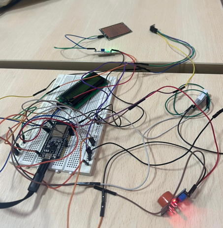
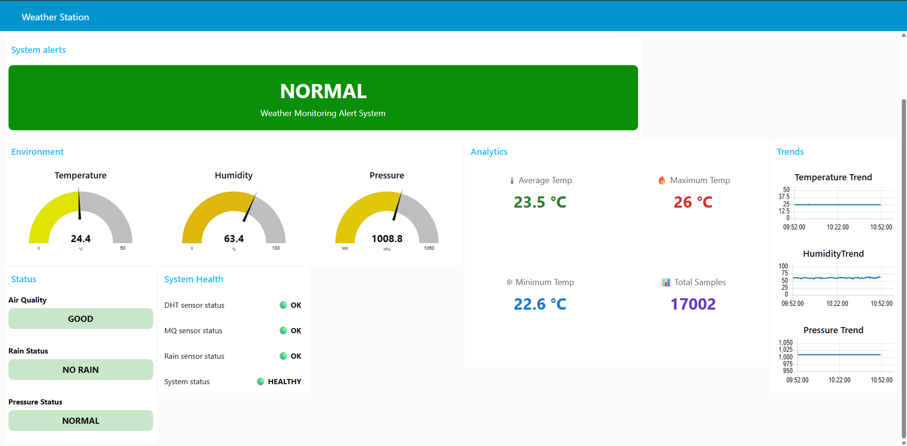
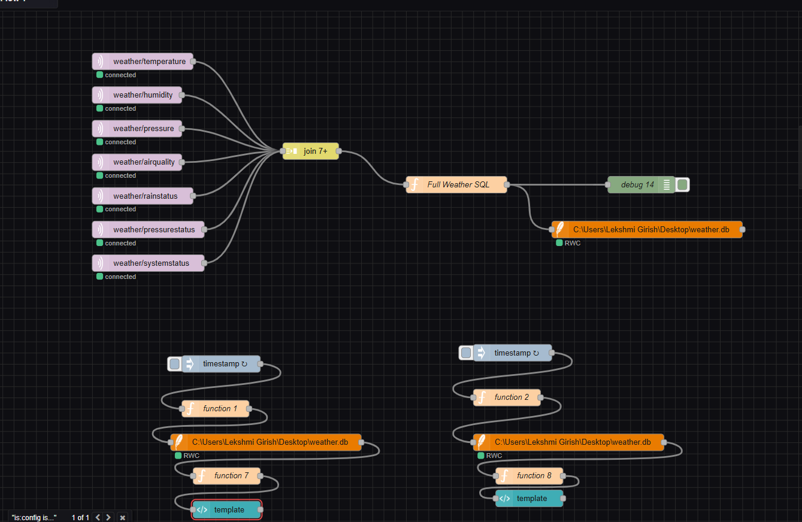

# 🌦️ IoT Smart Weather Monitoring System


An IoT-based Smart Weather Monitoring and Analytics System developed using the **ESP32** microcontroller, multiple environmental sensors, **HiveMQ Cloud**, **MQTT**, **Node-RED**, and **SQLite**. The system continuously monitors weather conditions, stores historical data, provides real-time analytics, and generates intelligent alerts through a dashboard and local LCD display.

---

## 🚀 Features

- 🌡️ Real-time Temperature Monitoring (DHT22)
- 💧 Humidity Monitoring
- 🌬️ Atmospheric Pressure & Altitude (BMP180)
- 🌫️ Air Quality Monitoring (MQ Sensor)
- 🌧️ Rainfall Detection
- 📡 MQTT Communication using HiveMQ Cloud
- 📊 Real-Time Node-RED Dashboard
- 🗄️ SQLite Database Storage
- 📈 Historical Data Analytics
- ⚠️ Intelligent Weather Alerts
- ❤️ Sensor Health Monitoring
- 🖥️ 16×2 I2C LCD Local Display

---

# 🛠️ Hardware Components

- ESP32 Development Board
- DHT22 Temperature & Humidity Sensor
- BMP180 Pressure & Altitude Sensor
- MQ Gas Sensor
- Rain Sensor Module
- 16×2 I2C LCD Display
- Breadboard
- Jumper Wires

---

# 🏗️ System Architecture

```
DHT22
BMP180
MQ Sensor
Rain Sensor
      │
      ▼
    ESP32
      │
      ▼
 HiveMQ Cloud
      │
      ▼
   Node-RED
      │
      ▼
SQLite Database
      │
      ▼
 Dashboard & Analytics
```

---

# 📊 Dashboard

The Node-RED dashboard provides:

- Real-time gauges
- Environmental status indicators
- Historical charts
- Analytics cards
- Alert panel
- Sensor health monitoring

---

# 📈 Analytics

The system calculates:

- Average Temperature
- Maximum Temperature
- Minimum Temperature
- Total Records Stored

using SQL queries on the SQLite database.

---

# ⚠️ Smart Alerts

The system generates alerts for:

- High Temperature
- Poor Air Quality
- Heavy Rain
- Sensor Failure
- System Fault
- Normal Operating Condition

---

# ☁️ Cloud Connectivity

The project uses **HiveMQ Cloud** as the MQTT broker for secure cloud-based communication between the ESP32 and the Node-RED dashboard.

---

# 📁 Repository Structure

```
IoT-Smart-Weather-Monitoring-System
│
├── Arduino_Code
├── Circuit_Diagram
├── Dashboard
├── Hardware
├── Images
├── NodeRED_Flows
├── Paper
└── README.md
```

---

# 📄 IEEE Paper

The IEEE-style conference paper describing this project is available in the **Paper** directory.

---

# 📸 Project Images

## Hardware Prototype

<p align="center">
  
</p>

## Node-RED Dashboard

<p align="center">
  
</p>

## Node-RED Flow


<p align="center">
  
</p>

---

# 🔮 Future Work

- Multi-node Weather Monitoring
- Mobile Application Integration
- Machine Learning-Based Weather Prediction
- Cloud Dashboard Deployment
- Smart City Environmental Monitoring

---

# 👨‍💻 Author

**Gaurav Thampy**

B.Tech Electronics and Communication Engineering

SRM Institute of Science and Technology, Ramapuram

---


